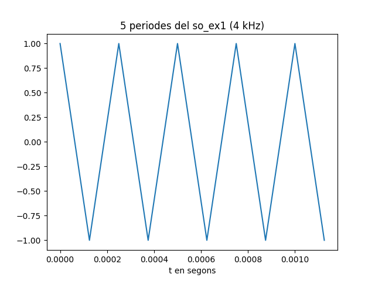
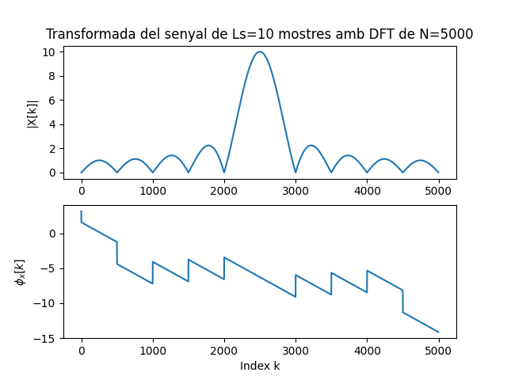
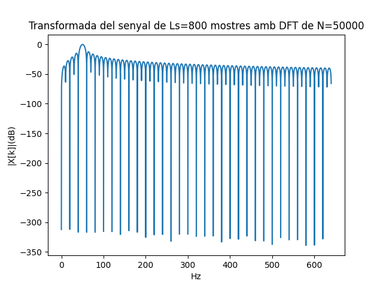

Primera tasca APA 2023: Anàlisi fitxer de so
============================================

## Nom i cognoms: Gerard Escardó Cabrerizo


## Representació temporal i freqüencial de senyals d'àudio.

### Domini temporal

Per llegir, escriure i representar un fitxer en format `*.wav` en python podem fem servir els següents mòduls:

- Numpy:
```python
import numpy as np
```
- Matplotlib: 
```python
import matplotlib.pyplot as plt
```
- Soundfile:
```python
import soundfile as sf
```

Per **crear** i **guardar** a un fitxer un senyal sinusoidal de freqüència `fx Hz`, digitalitzat a `fm Hz`, de durada `T` segons i amplitud 
`A` fem:

```python
T= 2.5                               # Durada de T segons
fm=8000                              # Freqüència de mostratge en Hz
fx=440                               # Freqüència de la sinusoide
A=4                                  # Amplitud de la sinusoide
pi=np.pi                             # Valor del número pi
L = int(fm * T)                      # Nombre de mostres del senyal digital
Tm=1/fm                              # Període de mostratge
t=Tm*np.arange(L)                    # Vector amb els valors de la variable temporal, de 0 a T
x = A * np.cos(2 * pi * fx * t)      # Senyal sinusoidal
sf.write('so_exemple1.wav', x, fm)   # Escriptura del senyal a un fitxer en format wav
```

El resultat és un fitxer guardat al directori de treball i que es pot reproduir amb qualsevol reproductor d'àudio

Per **representar** gràficament 5 períodes de senyal fem:

```python
Tx=1/fx                                   # Període del senyal
Ls=int(fm*5*Tx)                           # Nombre de mostres corresponents a 5 períodes de la sinusoide

plt.figure(0)                             # Nova figura
plt.plot(t[0:Ls], x[0:Ls])                # Representació del senyal en funció del temps
plt.xlabel('t en segons')                 # Etiqueta eix temporal
plt.title('5 periodes de la sinusoide')   # Títol del gràfic
plt.show()                                # Visualització de l'objecte gràfic. 
```

El resultat del gràfic és:


> Nota: Si es treballa amb ipython, es pot escriure %matplotlib i no cal posar el plt.show() per veure gràfics

El senyal es pot **escoltar (reproduir)** directament des de python important un entorn de treball amb els dispositius de so, com per 
exemple `sounddevice`:

```python
import sounddevice as sd      # Importem el mòdul sounddevice per accedir a la tarja de so
sd.play(x, fm)                # Reproducció d'àudio
```

### Domini transformat

Domini transformat. Els senyals es poden analitzar en freqüència fent servir la Transformada Discreta de Fourier. 

La funció que incorpora el paquet `numpy` al submòdul `fft` és `fft`:

```python
from numpy.fft import fft     # Importem la funció fft
N=5000                        # Dimensió de la transformada discreta
X=fft(x[0 : Ls], N)           # Càlcul de la transformada de 5 períodes de la sinusoide
```

I podem representar el mòdul i la fase, en funció de la posició de cada valor amb:

```python
k=np.arange(N)                        # Vector amb els valors 0≤  k<N

plt.figure(1)                         # Nova figura
plt.subplot(211)                      # Espai per representar el mòdul
plt.plot(k,abs(X))                    # Representació del mòdul de la transformada
plt.title(f'Transformada del senyal de Ls={Ls} mostres amb DFT de N={N}')   # Etiqueta del títol
plt.ylabel('|X[k]|')                  # Etiqueta de mòdul
plt.subplot(212)                      # Espai per representar la fase
plt.plot(k,np.unwrap(np.angle(X)))    # Representació de la fase de la transformad, desenroscada
plt.xlabel('Index k')                 # Etiqueta de l'eix d'abscisses 
plt.ylabel('$\phi_x[k]$')             # Etiqueta de la fase en Latex
plt.show()                            # Per mostrar els grafics
```


Proves i exercicis a fer i entregar
-----------------------------------

1. **Reprodueix l'exemple fent servir diferents freqüències per la sinusoide. Al menys considera $f_x = 4$ kHz, a banda d'una
    freqüència pròpia en el marge audible. Comenta els resultats**
    
    A part de la freqüència d'exemple (440 Hz) i de la de 4kHz, he provat amb una freqüència baixa, de 50 Hz. En quant a la creació i reproducció dels nous "wavs", s'aprecia perfectament quin fitxer correspon a cada freqüència, sent la de 50 Hz un to molt greu i la de 4 kHz un to molt més agut. Respecte a la representació de les gràfiques, agafant el mateix nombre de periodes, es veu clarament a les gràfiques que a més freqüència més curt el període i a la inversa:

    
    
    
    
    Finalment, a les transformacions de domini s'observa que com més baixa és la freqüència, més mostres s'agafen per representar la senyal transformada (en ordre, 50 Hz - 440 Hz - 4 kHz):

    
    
    


2. **Modifica el programa per considerar com a senyal a analitzar el senyal del fitxer wav que has creat 
    (`x_r, fm = sf.read('nom_fitxer.wav')`).**
    - Insereix a continuació una gràfica que mostri 5 períodes del senyal i la seva transformada.  
    
    ```python
    x_r, fm_r = sf.read('so_ex1_4000.wav')      #llegir so
    Tm_r=1/fm_r                                   #període de mostratge
    fx_r = fm_r/2                               #Nyquist per coneixer la frecuencia del to
    Tx_r=1/fx_r                                 #període de la senyal
    Lsx_r=int(fm_r*5*Tx_r)               # Nombre de mostres corresponents a 5 períodes de la sinusoide       
    Leng = len(x_r)                      #llargada de la señal
    T_r = Leng*Tm_r                      # Durada de T segons
    L_r = int(fm_r * T_r)                  # Nombre de mostres del senyal digital
    Tm=1/fm                              # Període de mostratge
    t_r=Tm_r*np.arange(L_r) 

    plt.figure(6)                             # Nova figura
    plt.plot(t_r[0:Lsx_r], x_r[0:Lsx_r])                # Representació del senyal en funció del temps
    plt.xlabel('t en segons')                 # Etiqueta eix temporal
    plt.title('5 periodes del so_ex1 (4 kHz)')   # Títol del gràfic
    plt.show() 
    }
    N=5000                         # Dimensió de la transformada discreta
    X_R=fft(x_r[0 : Lsx_r], N)           # Càlcul de la transformada de 5 períodes de la sinusoide
    k=np.arange(N)                        # Vector amb els valors 0≤  k<N

    plt.figure(7)                         # Nova figura
    plt.subplot(211)                      # Espai per representar el mòdul
    plt.plot(k,abs(X_R))                    # Representació del mòdul de la transformada
    plt.title(f'Transformada del senyal de Ls={Lsx_r} mostres amb DFT de N={N}')   # Etiqueta del títol
    plt.ylabel('|X[k]|')                  # Etiqueta de mòdul
    plt.subplot(212)                      # Espai per representar la fase
    plt.plot(k,np.unwrap(np.angle(X_R)))    # Representació de la fase de la transformad, desenroscada
    plt.xlabel('Index k')                 # Etiqueta de l'eix d'abscisses 
    plt.ylabel('$\phi_x[k]$')             # Etiqueta de la fase en Latex
    plt.show()                            # Per mostrar els grafics
    ```
    Gràfiques resultants del codi anterior:

    
    
    
    - Explica el resultat del apartat anterior.
    
    S'obté el mateix so que en cas anterior ja que la freqüència que s'utilitza és la mateixa, però la seva amplitud es veu reduida a un quart de l'amplitud original, quan creavem el so.

3. **Modifica el programa per representar el mòdul de la Transformada de Fourier en dB i l'eix d'abscisses en el marge de
    $0$ a $f_m/2$ en Hz.**
    
    Per aquest exercici es fa servir el to de 50 Hz de l'exercici 1, canviant la dimensió de la transformada discreta a N=50000, per poder visualitzar adequadament la gràfica:
    ```python
        T= 2.5                               # Durada de T segons
        fm=8000                              # Freqüència de mostratge en Hz
        fz=50                         # Freqüència ex1
        A=4                                  # Amplitud de la sinusoide
        pi=np.pi                             # Valor del número pi
        L = int(fm * T)                      # Nombre de mostres del senyal digital
        Tm=1/fm                              # Període de mostratge
        t=Tm*np.arange(L)                 # Vector amb els valors de la variable temporal, de 0 a T
        z = A * np.cos(2 * pi * fz * t)  # Senyal sinusoidal ex1
        sf.write('so_ex1_50.wav', z, fm)   # Escriptura del senyal a un fitxer en format wav

        Tz=1/fz                        # Període del senyal ex1
        Lsz=int(fm*5*Tz)             # Nº mostres ex1

        import sounddevice as sd      # Importem el mòdul sounddevice per accedir a la tarja de so
        sd.play(z, fm)                # Reproducció d'àudio

        from numpy.fft import fft     # Importem la funció fft
        N=50000                      # Dimensió de la transformada discreta
        Z=fft(z[0 : Lsz], N)       
        Z_dB = 20*np.log10(np.abs(Z)/max(np.abs(Z)))
        k=np.arange(N)                        # Vector amb els valors 0≤  k<N
        fk =(k/N)*fm
        plt.figure(8)                         # Nova figura          
        plt.plot(fk[0:int(fm/2)], Z_dB[0:int(fm/2)])          # Representació del mòdul de la transformada
        plt.title(f'Transformada del senyal de Ls={Lsz} mostres amb DFT de N={N}')   # Etiqueta del títol
        plt.ylabel('|X[k]|(dB)')                  # Etiqueta de mòdul
        plt.xlabel('Hz')                  # Etiqueta de mòdul
        plt.show()  
    ```

    Gràfica resultant del codi anterior:

    


    - Comprova que la mesura de freqüència es correspon amb la freqüència de la sinusoide que has fet servir.
    
    La mesura de freqüència es correspon amb la freqüència de la sinusoide (50 Hz), ja que el seu pic (valor màxim d'amplitud) al mòdul de la transformada està pel valor de 50 Hz a l'eix X.

    - Com pots identificar l'amplitud de la sinusoide a partir de la representació de la transformada? Comprova-ho amb el senyal generat.
    
    L'amplitud màxima del mòdul és 0 dB. L'amplitud de la sinusoide equivaldrà a aquest valor passat a escala líneal: 10^(0/20) = 1 = Amplitud de la sinusoide.


      

> NOTES:
>
> - Per representar en dB has de fer servir la fórmula següent:
>
> $X_{dB}(f) = 20\log_{10}\left(\frac{\left|X(f)\right|}{\max(\left|X(f)\right|}\right)$
>
> - La relació entre els valors de l'índex k i la freqüència en Hz és:
>
> $f_k = \frac{k}{N} f_m$

4. **Tria un fitxer d'àudio en format wav i mono (el pots aconseguir si en tens amb altres formats amb el programa Audacity). 
    Llegeix el fitxer d'àudio i comprova:**

    - Freqüència de mostratge.
    - Nombre de mostres de senyal.
    - Tria un segment de senyal de 25ms i insereix una gráfica amb la seva evolució temporal.
    - Representa la seva transformada en dB en funció de la freqüència, en el marge $0\le f\le f_m/2$.
    - Quines son les freqüències més importants del segment triat?


Entrega
-------

- L'alumne ha de respondre a totes les qüestions formulades en aquest mateix fitxer, README.md.
    - El format del fitxer es l'anomenat *Markdown* que permet generar textos amb capacitats gràfiques (com ara *cursiva*, **negreta**,
      fòrmules matemàtiques, taules, etc.), sense perdre la llegibilitat en mode text.
    - Disposa d'una petita introducció a llenguatge de Markdown al fitxer `MARKDOWN.md`.
- El repositori GitHub ha d'incloure un fitxer amb tot el codi necesari per respondre les qüestions i dibuixar les gràfiques.
- El nom del fitxer o fitxers amb el codi ha de començar amb les inicials de l'alumne (per exemple, `fvp_codi.py`).
- Recordéu ficar el el vostre nom complet a l'inici del fitxer o fitxers amb el codi i d'emplar el camp `Nom i cognoms` a dalt de tot
  d'aquest fitxer, README.md.
